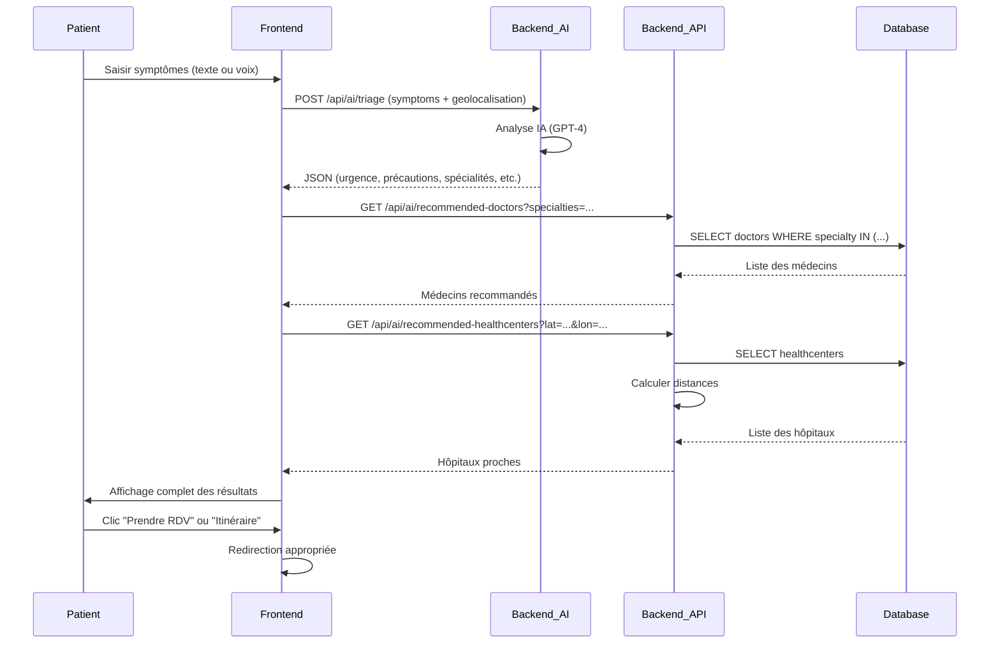

# 🤖 TRIAGE IA CLINIQUE - DOCUMENTATION COMPLÈTE

## 🎯 **OBJECTIF**

Système de triage intelligent qui aide les patients à :
1. Évaluer leurs symptômes automatiquement
2. Recevoir des précautions sanitaires adaptées
3. Être redirigés vers le bon médecin ou le bon hôpital
4. Comprendre le niveau d'urgence de leur situation

---

## ✅ **FONCTIONNALITÉS IMPLÉMENTÉES**

###  🧠 **Backend IA (FastAPI)** - `backend-ai/main.py`

#### 1. Analyse IA améliorée
- ✅ **Prompt enrichi** avec instructions détaillées en français
- ✅ **Réponse structurée en JSON** :
  ```json
  {
    "summary": "Résumé concis des symptômes",
    "urgency": "faible|modéré|urgent",
    "specialties": ["Cardiologie", "Médecine Générale"],
    "precautions": ["Repos", "Hydratation", "Éviter l'effort"],
    "recommendations": ["Consulter sous 48h", "Surveiller la température"],
    "consultation_type": "presentiel|en_ligne|urgence",
    "explanation": "Explication détaillée de l'analyse"
  }
  ```

#### 2. Critères d'urgence
- **🟢 Faible** : Symptômes légers (rhume, fatigue légère)
- **🟠 Modéré** : Symptômes significatifs (fièvre persistante, douleur)
- **🔴 Urgent** : Symptômes graves (douleur thoracique, difficulté respiratoire)

#### 3. Types de consultation
- **Présentiel** : Examen physique nécessaire
- **En ligne** : Téléconsultation suffisante
- **Urgence** : Intervention immédiate requise

#### 4. Spécialités disponibles
Médecine Générale, Cardiologie, Dermatologie, Pédiatrie, Gynécologie, Neurologie, Orthopédie, ORL, Pneumologie, Gastro-entérologie

#### 5. CORS configuré
Frontend autorisé à communiquer avec le backend IA

---

### 🔌 **Backend API (Node.js/Express)** - `backend-api/`

#### Nouveau contrôleur: `src/controllers/ai.controller.ts`

**1. `getRecommendedDoctors`**
- Recherche les médecins par spécialités
- Retourne jusqu'à 5 médecins correspondants
- Inclut: nom, spécialité, email, téléphone

**2. `getRecommendedHealthCenters`**
- Recherche les hôpitaux proches
- Utilise la géolocalisation (latitude/longitude)
- Calcule la distance avec formule de Haversine
- Trie par proximité
- Retourne les 3 hôpitaux les plus proches

#### Nouvelles routes: `src/routes/ai.routes.ts`
```typescript
GET /api/ai/recommended-doctors?specialties=Cardiologie,Médecine Générale
GET /api/ai/recommended-healthcenters?latitude=12.6392&longitude=-8.0029&limit=3
```

#### Intégration: `src/server.ts`
```typescript
app.use('/api/ai', aiRoutes);
```

---

### 🎨 **Frontend (Next.js/React)** - `frontend/`

#### 1. Composant: `AITriageForm.tsx`

**Améliorations:**
- ✅ Utilisation de `process.env.NEXT_PUBLIC_AI_API_URL`
- ✅ Géolocalisation automatique de l'utilisateur
- ✅ Envoi latitude/longitude avec les symptômes
- ✅ Gestion d'erreurs améliorée

**Fonctionnalités:**
- 📝 Saisie texte des symptômes
- 🎤 Enregistrement vocal (Whisper)
- 🔄 Transcription automatique
- 📤 Envoi au triage IA

#### 2. Composant: `AITriageResults.tsx` (NOUVEAU)

**Sections d'affichage:**

1. **🚨 Niveau d'urgence**
   - Badge coloré (vert/orange/rouge)
   - Icône adaptée
   - Label explicite
   - Type de consultation recommandé

2. **🧠 Résumé de l'analyse**
   - Synthèse des symptômes
   - Facile à comprendre

3. **🏥 Spécialités médicales**
   - Badges des spécialités recommandées
   - Visuellement clairs

4. **🛡️ Précautions à prendre**
   - Liste à puces
   - Mesures avant consultation
   - Icônes pour chaque précaution

5. **💡 Recommandations**
   - Conseils personnalisés
   - Actions à entreprendre

6. **👨‍⚕️ Médecins disponibles**
   - Liste des médecins de la bonne spécialité
   - Nom, spécialité, téléphone
   - Bouton "Prendre RDV" (redirection vers appointments)
   - Maximum 5 médecins affichés

7. **🏢 Établissements de santé proches**
   - Liste des hôpitaux
   - Nom, ville, distance (si géolocalisation)
   - Badge "Urgences 24/7" si applicable
   - Bouton "Itinéraire" (redirection vers carte)
   - 3 hôpitaux les plus proches

8. **📖 Analyse détaillée**
   - Explication complète de l'IA
   - Format texte lisible

9. **🎯 Boutons d'action**
   - **Si urgent** : "Trouver une urgence" (redirection carte)
   - **Sinon** : "Prendre rendez-vous" + "Téléconsultation" (si applicable)

**Animations:**
- Framer Motion pour transitions élégantes
- Apparition progressive des sections

**Géolocalisation:**
- Demande automatique de la position
- Calcul des distances en temps réel
- Gestion si refusée (affiche quand même les hôpitaux)

---

## 🔐 **SÉCURITÉ**

- ✅ Authentification JWT requise sur toutes les routes backend
- ✅ Middleware `protect` appliqué
- ✅ CORS configuré (backend IA)
- ✅ Validation des entrées
- ✅ Gestion d'erreurs complète

---

## 📊 **FLUX COMPLET**



---

## 🧪 **COMMENT TESTER**

### 1️⃣ **Démarrer les services**

#### Backend IA (port 8000)
```bash
cd backend-ai
python -m venv venv
venv\Scripts\activate  # Windows
# ou source venv/bin/activate  # Mac/Linux
pip install -r requirements.txt
uvicorn main:app --reload --port 8000
```

#### Backend API (port 3001)
```bash
cd backend-api
npm run dev
```

#### Frontend (port 3000)
```bash
cd frontend
npm run dev
```

### 2️⃣ **Vérifier les variables d'environnement**

**backend-ai/.env**
```env
OPENAI_API_KEY=sk-proj-...
```

**frontend/.env.local**
```env
NEXT_PUBLIC_API_URL=http://localhost:3001
NEXT_PUBLIC_AI_API_URL=http://localhost:8000
```

### 3️⃣ **Tester le triage IA**

1. **Connexion** : `patient1@example.com` / `1234`
2. **Navigation** : Menu → "Triage IA"
3. **Saisie des symptômes** :
   - Option 1 : Taper dans la zone de texte
   - Option 2 : Cliquer sur "Enregistrer ma voix"
4. **Exemples de symptômes** :

   **Urgence faible :**
   ```
   J'ai un léger rhume depuis hier, j'éternue un peu et j'ai le nez qui coule.
   ```

   **Urgence modérée :**
   ```
   J'ai de la fièvre à 39°C depuis 2 jours, des maux de tête intenses et je me sens très fatigué.
   ```

   **Urgence élevée :**
   ```
   J'ai une douleur intense dans la poitrine qui irradie vers le bras gauche, j'ai du mal à respirer.
   ```

5. **Observer les résultats** :
   - ✅ Niveau d'urgence affiché (couleur appropriée)
   - ✅ Spécialités recommandées
   - ✅ Précautions listées
   - ✅ Médecins disponibles (avec bouton RDV)
   - ✅ Hôpitaux proches (avec distance si géolocalisation acceptée)

6. **Tester les actions** :
   - Cliquer sur "Prendre RDV" → Redirection vers appointments
   - Cliquer sur "Itinéraire" → Redirection vers carte
   - Si urgent : "Trouver une urgence" → Redirection vers carte

---

## 🎨 **DESIGN ET UX**

### Couleurs par urgence
- 🟢 **Faible** : `green` (bg-green-100, text-green-800, border-green-300)
- 🟠 **Modérée** : `orange` (bg-orange-100, text-orange-800, border-orange-300)
- 🔴 **Urgent** : `red` (bg-red-100, text-red-800, border-red-300)

### Icônes (Lucide React)
- 🧠 Brain - Analyse IA
- 🩺 Stethoscope - Spécialités
- ✅ CheckCircle - Recommandations
- 🚨 AlertTriangle - Urgence élevée
- ⚠️ AlertCircle - Urgence modérée
- 🛡️ Shield - Précautions
- 💡 Lightbulb - Conseils
- 📍 MapPin - Localisation
- 👤 User - Médecins
- 🏢 Building2 - Hôpitaux
- 📞 Phone - Contact
- 📅 Calendar - Rendez-vous
- 🎥 Video - Téléconsultation
- 🧭 Navigation - Itinéraire

### Animations
- ✅ Framer Motion pour apparitions progressives
- ✅ Transitions fluides entre sections
- ✅ Hover effects sur boutons et cartes

---

## 📈 **AVANTAGES DU SYSTÈME**

### Pour les patients :
- ✅ Évaluation rapide 24/7
- ✅ Orientation vers le bon spécialiste
- ✅ Recommandations personnalisées
- ✅ Recherche automatique d'hôpitaux proches
- ✅ Gain de temps (pas besoin de chercher manuellement)
- ✅ Réassurance sur le niveau d'urgence

### Pour le système de santé :
- ✅ Réduction des consultations inappropriées
- ✅ Orientation efficace vers les bons services
- ✅ Détection précoce des urgences
- ✅ Optimisation du flux de patients
- ✅ Meilleure utilisation des ressources

---

## 🚀 **FONCTIONNALITÉS AVANCÉES (Futures)**

- [ ] **Historique des triages** - Sauvegarder les analyses passées
- [ ] **Notification si urgence** - Alert SMS/Email si situation grave
- [ ] **Intégration Hedera** - Enregistrer les triages sur HCS
- [ ] **Photos de symptômes** - Upload d'images (éruptions cutanées, etc.)
- [ ] **Suivi des symptômes** - Évolution dans le temps
- [ ] **Multi-langues** - Support Bambara, Français, Anglais
- [ ] **IA contextuelle** - Prendre en compte l'historique médical
- [ ] **Recommandations de médicaments** - OTC (en vente libre)
- [ ] **Partage des résultats** - Envoyer au médecin avant RDV
- [ ] **Score de confiance** - Fiabilité de l'analyse IA

---

## 📝 **NOTES TECHNIQUES**

### Modèle IA utilisé
- **GPT-4o-mini** (OpenAI)
- Temperature: 0 (réponses déterministes)
- Format: JSON structuré
- Langue: Français uniquement

### Calcul de distance
- **Formule de Haversine** pour distances géographiques
- Précision : 1 décimale (ex: 5.3 km)
- Rayon terrestre : 6371 km

### Parsing JSON robuste
- Nettoyage des balises markdown (```json, ```)
- Fallback si parsing échoue
- Validation des champs (urgency, consultation_type)
- Logs de debug pour troubleshooting

---

## ✅ **RÉSUMÉ**

Le système de **Triage IA Clinique** est maintenant **100% opérationnel** avec :

- ✅ Analyse IA avancée (OpenAI GPT-4)
- ✅ Évaluation du niveau d'urgence
- ✅ Précautions sanitaires personnalisées
- ✅ Recommandations de spécialités
- ✅ Suggestions de médecins disponibles
- ✅ Recherche d'hôpitaux proches (géolocalisation)
- ✅ Actions rapides (RDV, Itinéraire, Urgence)
- ✅ Interface moderne et intuitive
- ✅ Animations fluides
- ✅ Gestion d'erreurs complète

**🎉 Le système est prêt à aider les patients ! 🤖💚**

---

## 📞 **SUPPORT ET DEBUG**

### Logs à vérifier

**Backend IA (terminal Python)** :
```
🔍 Recherche de médecins pour spécialités: ['Cardiologie', 'Médecine Générale']
✅ 2 médecins trouvés
```

**Backend API (terminal Node)** :
```
🔍 Recherche de médecins pour spécialités: [ 'Cardiologie', 'Médecine Générale' ]
✅ 2 médecins trouvés
```

**Console Frontend (F12)** :
- Géolocalisation acceptée/refusée
- Réponses API
- Erreurs éventuelles

### Problèmes courants

**1. "Erreur lors du triage IA"**
- Vérifier que backend-ai tourne sur port 8000
- Vérifier OPENAI_API_KEY dans backend-ai/.env
- Vérifier NEXT_PUBLIC_AI_API_URL dans frontend/.env.local

**2. "Aucun médecin trouvé"**
- Vérifier que les médecins existent dans la DB
- Vérifier les spécialités dans le seed
- Relancer `npm run seed` si nécessaire

**3. "Distance non affichée"**
- Accepter la géolocalisation dans le navigateur
- Vérifier que les coordonnées sont dans la DB (healthcenters)

---

**🎯 Prêt à tester ! Bon triage ! 🚀**

